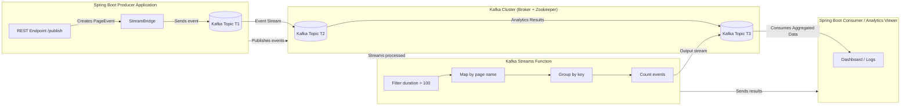

# Event-Driven Architecture (EDA) with Kafka and Spring Cloud Streams

This repository provides a **practical demonstration** of an **Event-Driven Architecture (EDA)**, focusing on **messaging concepts (JMS)** and implementing a robust solution based on **Apache Kafka** and **Spring Cloud Stream Functions**.


## 1. Project Overview

This project showcases a **distributed event-driven system**.
It uses **Docker Compose** to launch a single-node Kafka cluster and a **Spring Boot** application for producing, consuming, and analyzing real-time data streams.

**Main objectives:**

1. Understand how a **message broker** (Kafka) works.
2. Explore **Kafka’s flexibility** to simulate both **Queue** and **Topic** messaging models.
3. Demonstrate **real-time data analytics** using **Kafka Streams** integrated with Spring Cloud Streams.


## 2. Core Concepts of Event-Driven Architecture

EDA relies on sending messages from a **producer** to a **consumer** through a **message broker**.

### 2.1. JMS (Java Message Service) API

JMS is a Java API that enables applications to create, send, receive, and read messages in a **loosely coupled, asynchronous, and reliable** way.

**Key JMS Components:**

| Component              | Description                                                                                                                                       |
| :--------------------- | :------------------------------------------------------------------------------------------------------------------------------------------------ |
| **Connection Factory** | Entry point for JMS clients used to create a `Connection`.                                                                                        |
| **Connection**         | Active link to the message broker, used to create `Session` objects.                                                                              |
| **Session**            | Single-threaded context for producing and consuming messages. Allows creating `MessageProducer`, `MessageConsumer`, `Message`, and `Destination`. |
| **Destination**        | Message target or source. Can be a **Queue** (point-to-point) or a **Topic** (publish/subscribe).                                                 |
| **Message**            | The data being transferred (text, bytes, objects, or maps).                                                                                       |

**Destination Types:**

* **Queue protocol:** *One-to-one* communication. Each message is consumed **once** by a single consumer.
* **Topic protocol:** *One-to-many* communication. Each message can be received by **multiple consumers**.


### 2.2. Kafka: Architecture and Scalability

Kafka is designed for **Big Data** — it stores and processes large volumes of data in a distributed and fault-tolerant way.

* **Zookeeper** acts as the coordinator managing metadata, cluster membership, and leader election among Kafka brokers.
* **Partitions and Replicas:**
  A **Topic** (like a book) is split into **Partitions** (like chapters). To ensure resilience, **replicas** (copies) of each partition are stored on other brokers. Each partition has a **leader** (handles reads/writes) and one or more **followers** (synchronized copies).
* **Scalability:**
  Kafka achieves **horizontal scalability** by increasing the **number of partitions**. The maximum number of active consumers in a group equals the number of partitions.


### 2.3. Consumption Models: Pull vs Push

| Method   | Description                                                                                                             | Typical Context |
| :------- | :---------------------------------------------------------------------------------------------------------------------- | :-------------- |
| **Push** | The JMS server automatically pushes messages to consumers as soon as they arrive (asynchronous via *Message Listener*). | **JMS**         |
| **Pull** | The consumer explicitly requests messages from the server (`receive()`), deciding when and how much to consume.         | **Kafka**       |

> **Kafka Note:** Kafka **never deletes messages immediately**. Topics retain data, giving consumers full control over message offset and retrieval (pull model).


### 2.4. Kafka and Consumer Groups (JMS Emulation)

Kafka uses only **Topics**, but it can simulate both **Queue** and **Topic** messaging models through **Consumer Groups**.

| Kafka Setup                              | Behavior                                             | JMS Equivalent      |
| :--------------------------------------- | :--------------------------------------------------- | :------------------ |
| **One topic + one consumer group**       | Each message is processed **once** (load balancing). | **Queue**           |
| **One topic + multiple consumer groups** | Each group receives all messages.                    | **Topic** (Pub/Sub) |


## 3. Environment Setup and Configuration

The project environment is configured through `docker-compose.yml`.

### 3.1. Start the Broker

1. Ensure Docker is running.
2. Launch the `zookeeper` and `broker` (Kafka) services defined under `services`.

The Kafka broker is configured with `KAFKA_BROKER_ID=1` and connects to Zookeeper via `zookeeper:2181`.
Clients can access Kafka at `localhost:9092`.


### 3.2. CLI Testing (Consumer and Producer)

You can interact directly with Kafka through Docker CLI commands.

**Start a Consumer for topic `T1`:**

```bash
docker exec -it broker-event-driven kafka-console-consumer --bootstrap-server broker:9092 --topic T1
```

To read messages **from the beginning** (offset zero):

```bash
docker exec -it broker-event-driven kafka-console-consumer --bootstrap-server broker:9092 --topic T1 --from-beginning
```

**Start a Producer for topic `T1`:**

```bash
docker exec -it broker-event-driven kafka-console-producer --bootstrap-server broker:9092 --topic T1
```


## 4. Spring Cloud Stream Implementation

The project includes a **Spring Boot** application to handle event flows.

### 4.1. Event Producer (PageEventController)

The application exposes a REST controller (`PageEventController`) to publish events to Kafka.

* **Payload:** The sent event is a `PageEvent` record (an immutable data class) containing `name`, `user`, `date`, and `duration`.
* **Endpoint:** `/publish` accepts query parameters `name` and `topic`.
* **Sending Mechanism:** The `StreamBridge` component is used to send events:

  ```java
  streamBridge.send(topic, event);
  ```

  `StreamBridge` manages conversion and routing to the proper topic.
  It works with any supported binder, not just Kafka.
  Alternatively, you can use:

  ```java
  kafkaTemplate.send(topic, event);
  ```

**Example request:**

```
http://localhost:8080/publish?name=P1&topic=T1
```


### 4.2. Real-Time Analytics with Kafka Streams Function

A **stream function** (declared in `application.yml` via `spring.cloud.stream.function.definition`) processes data in real-time.

The function takes an input stream `KStream<String, PageEvent>` and produces an output stream `KStream<String, Long>` representing counts.

**Processing steps:**

1. **Filtering:** Keep only events where `duration() > 100` (removes noise).
2. **Mapping:** Change the key to `v.name()` (page name) and value to `v.duration()`.
3. **Grouping:** Group the stream by the new key (page name).
4. **Counting:** Aggregate using `.count()` to produce a `KTable<String, Long>`.
5. **Conversion:** Convert the aggregated table back to a `KStream` and publish it to an output topic (e.g., `T3`).

**Deserialization Note:**
When consuming aggregated results, ensure proper deserializers are used:

```
key.deserializer=org.apache.kafka.common.serialization.StringDeserializer
value.deserializer=org.apache.kafka.common.serialization.LongDeserializer
```

## 5. Architecture Diagram



